# Specs

The goal of this application is to enable businesses to automate their invoice ingestion for accounting. It does so by automatically converting invoice artifacts, such as PDFs, into structured importable formats, like CSV.

```mermaid
flowchart LR
  External_Source["External Source<br />Gmail, Manual Upload, Etc"]
  Raw_Invoice["Raw Invoice"]

  External_Source --> Raw_Invoice

  subgraph Invoice_Facts_Extractor_Service["Invoice Facts Extractor Service"]
    direction LR

    IFES_Run_Image_Through_OCR["Run image through OCR"]
    IFES_Extract_Normalized_Data_From_OCR["Extract normalized data from OCR"]
    IFES_Loop_Over_Identified_Data["Loop Over Identified Data"]

    subgraph IFES_Loop_1["Loop"]
      direction LR
      IFES_Validate_Extraction["Validate Extraction"]
      IFES_Add_To_Digest["Add To Digest"]

      IFES_Validate_Extraction --> IFES_Add_To_Digest
    end

    IFES_Return_Digest["Return Digest"]

    IFES_Run_Image_Through_OCR --> IFES_Extract_Normalized_Data_From_OCR
    IFES_Extract_Normalized_Data_From_OCR --> IFES_Loop_Over_Identified_Data
    IFES_Loop_Over_Identified_Data --> IFES_Loop_1

    IFES_Loop_1 --> IFES_Return_Digest
  end

  Raw_Invoice --> Invoice_Facts_Extractor_Service

```

1. An external source sends a Raw Invoice (unprocessed invoice in any format) through a channel such as Gmail.
2. Our external source connector emits an event indicating a Raw Invoice arrived.
3. The Invoice Facts Extractor Service (IFES) receives the event, processes the Raw Invoice, then emits an event indicating the Digest was created.

## Invoice Extraction

The extraction process occurs through the following steps:

1. **Text Extraction:** We first convert the entirety of the invoice into a `.tsv` format using Tesseract OCR.
2. **Categorization:** Once the invoice is represented in a `.tsv` format, we run the text through an AI node that categorizes Snippets that it recognizes can be used to fill our standardized invoice format.
3. **Synthesization:** Each of the Snippets categorized are processed by an AI node specialized in extracting data from unformatted text, returning a Synthesis.
4. **Validation:** Each Synthesis is processed to check for validity, e.g. no numbers in a field that represents a price. This may be done by either one or a combination of an AI node and functional processes. Each Synthesis Category has its own validation pipeline.
